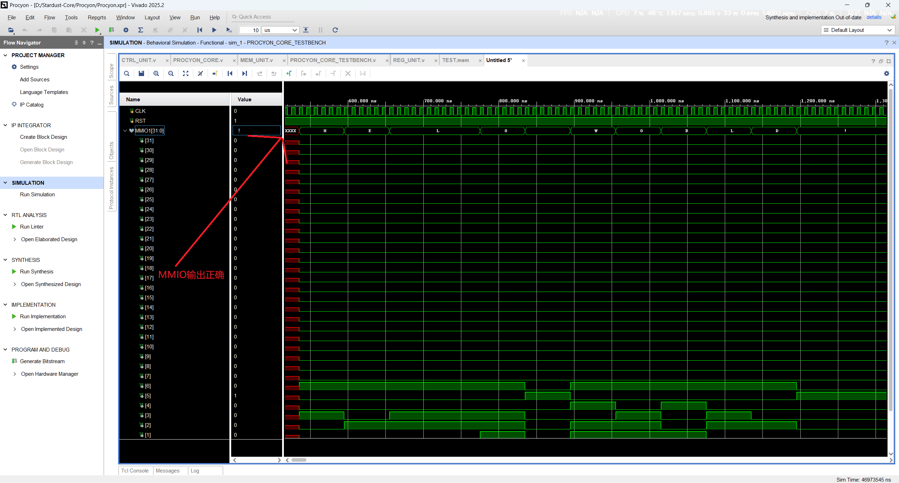

# Stardust-Core

从零开始手写的 RISC-V CPU 核心系列，以恒星名称作为微架构代号。

第一代 Procyon（南河三）单周期 RV32I 处理器已完成指令集验证。

## 快速开始

在 Vivado 行为仿真中运行 `PROCYON_CORE_TESTBENCH`，MMIO1 端口输出：
```
HELLO WORLD!
```


### 上手指南

1. Vivado 打开项目
2. 添加 `Procyon/src/` 与 `Procyon/tb/` 下全部文件
3. 设置 `PROCYON_CORE_TESTBENCH.v` 为顶层
4. 运行 Behavioral Simulation
5. 观察 `MMIO1[31:0]` 信号

## 微架构路线图

| 代号 | 中文名 | 说明 | 状态 |
|:---:|:---|:---|:---:|
| **Procyon** | 南河三 | 单周期设计，支持 RV32I 除特权指令以外的全部指令，12-bit 地址空间，支持 MMIO 输出 | 已完成 |
| Sirius | 天狼星 | 多周期 / 流水线（规划中） | 待定 |

## 文档 (尚未完成)

| 文档 | 说明 |
|:---|:---|
| [Procyon 设计文档](docs/Procyon.md) | 架构、数据通路、控制信号说明 (未完成)|
| [指令集验证测试](docs/Procyon_Test.md) | HELLO WORLD 集成测试汇编源码与波形分析 (未完成) |
| [开发日志](docs/Changelog.md) | 版本迭代记录 |

## 目录结构

```
Stardust-Core/
├── Procyon/
│   ├── src/              # Verilog 源码
│   ├── tb/               # Testbench
│   ├── asm/              # 测试汇编程序
│   └── constraints/      # 时序约束
├── docs/                 # 设计文档与截图
└── README.md
```

## 许可证

Copyright (c) 2026 mio-qwq. All Rights Reserved.
